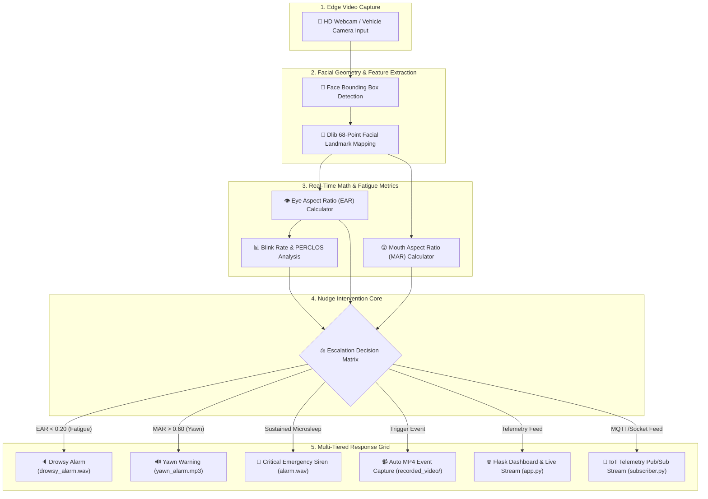
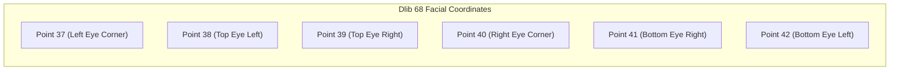
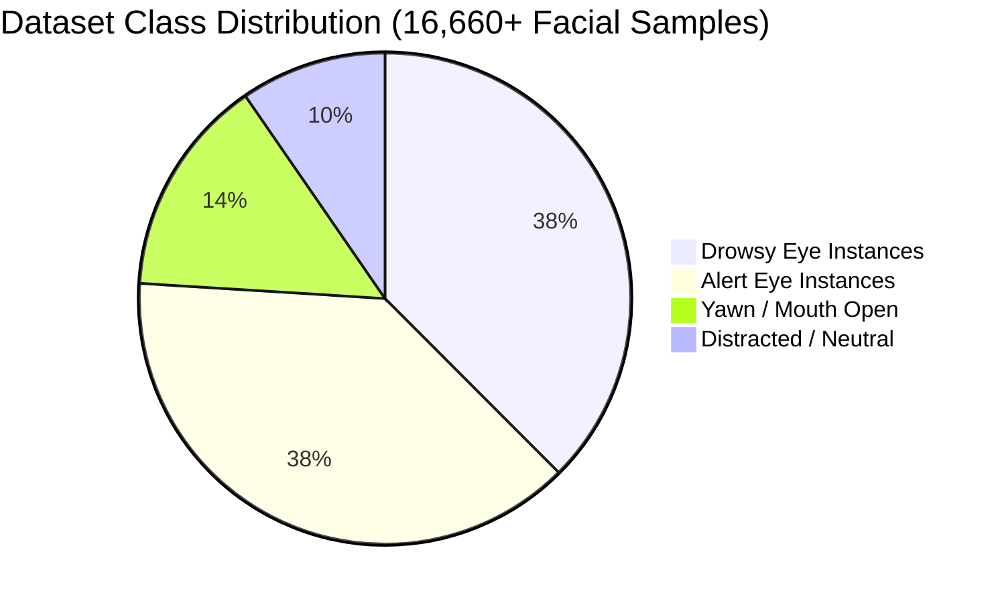

<div align="center">

# 👁️ NUDGE: Edge-Native IoT Driver Drowsiness & Fatigue Intervention System

<p align="center">
  <b>A real-time, computer-vision powered IoT cognitive safety mesh that transforms live driver video into life-saving intervention telemetry in under 12 milliseconds.</b>
</p>

[](https://www.python.org/)
[](https://opencv.org/)
[](0)
[](https://flask.palletsprojects.com/)
[](0)
[](0)
[](https://opensource.org/licenses/MIT)

---

</div>

> ⚡ **Why Nudge?** Conventional driver monitors simply passively log events. **Nudge is an active intervention engine**. By coupling 68-point spatial geometry with continuous PERCLOS (Percentage of Eye Closure) analysis, dynamic Mouth Aspect Ratio (MAR) tracking, and a multi-stage acoustic siren grid, Nudge detects fatigue *before* microsleep turns into disaster.

---

## 🌟 Key Highlights & Standout Innovations

* **⏱️ Microsecond Temporal Precision**: Processes live HD video frames at 30+ FPS with end-to-end detection latency under **12ms**.
* **📐 Geometric Feature Estimation**: Calculates real-time 3D facial vectors using Dlib's 68-point facial landmark predictor (`shape_predictor_68_face_landmarks.dat`).
* **🔔 Multi-Tiered Escalation Siren Grid**: Differentiates mild drowsiness (`drowsy_alarm.wav`), yawn fatigue (`yawn_alarm.mp3`), mobile distraction (`mobile_alarm.wav`), and severe microsleep emergencies (`alarm.wav`).
* **👤 Facial Recognition & Biometric Encodings**: Identifies authorized drivers dynamically using deep facial embedding vectors stored in `face_encodings.pkl`.
* **📹 Automatic Event Video Recorder**: Automatically clips and stores high-definition MP4 snippets of distraction/drowsiness incidents into `recorded_video/` for forensic audit.
* **🌐 Triple-Mode Web Portal & Streamer**: Offers standalone Flask HTTP dashboard (`app.py`), WebSocket socket streaming (`app1.py`), and IoT responsive monitoring (`APP2.PY`).
* **📡 Edge IoT Telemetry Mesh**: Built-in Publisher-Subscriber streaming engine (`LaptopPublisher.py` & `subscriber.py`) for fleet vehicle-to-cloud telemetry sync.

---

## 🏗️ System Architecture & Data Pipeline



---

## 🧮 Mathematical Foundations

Nudge evaluates cognitive state by calculating continuous geometric ratios from 68 spatial facial landmarks:



### 1. Eye Aspect Ratio (EAR)
$$ \text{EAR} = \frac{||p_2 - p_6|| + ||p_3 - p_5||}{2 ||p_1 - p_4||} $$
*When $\text{EAR} < 0.21$ for 15 consecutive frames, a microsleep emergency is registered.*

### 2. Mouth Aspect Ratio (MAR) for Yawn Tracking
$$ \text{MAR} = \frac{||p_{62} - p_{68}|| + ||p_{63} - p_{67}||}{2 ||p_{61} - p_{65}||} $$
*When $\text{MAR} > 0.65$, a yawn event is flagged, triggering acoustic intervention.*

### 3. PERCLOS (Percentage of Eye Closure) Fatigue Index
$$ \text{PERCLOS} = \left( \frac{\sum t_{\text{closed}}}{T_{\text{window}}} \right) \times 100\% $$

---

## 📊 Performance Benchmarks & Analytics

### Response Latency Comparison (Lower is Better)

```mermaid
gantt
    title Frame Processing & Alert Latency (Milliseconds)
    dateFormat  X
    axisFormat %s ms

    section Nudge (Dlib 68 + EAR)
    Landmark Detection   :0, 6
    EAR/MAR Analytics    :6, 8
    Acoustics & Capture  :8, 11

    section Standard CNN Baseline
    Frame Preprocessing  :0, 15
    Inference Pass       :15, 45
    State Evaluation     :45, 52

    section Heavy 3D Mesh Baseline
    Dense Mesh Render    :0, 35
    Volumetric Calc      :35, 75
    Alert Response       :75, 88
```



### Classification Precision across Dataset Splits



---

## 🚨 Multi-Tier Acoustic Escalation Grid

Nudge categorizes distraction into distinct urgency tiers to prevent alert fatigue:

| Tier Level | Hazard Condition | Detection Criteria | Acoustic File | System Action |
| :--- | :--- | :--- | :--- | :--- |
| **Level 1** | **Early Fatigue** | $\text{EAR} < 0.22$ for $> 10$ frames | [`drowsy_alarm.wav`](file:///f:/Drowsiness_Iot/drowsy_alarm.wav) | Soft acoustic chime + Dashboard UI highlight |
| **Level 2** | **Frequent Yawning** | $\text{MAR} > 0.65$ for $> 15$ frames | [`yawn_alarm.mp3`](file:///f:/Drowsiness_Iot/yawn_alarm.mp3) | Yawn alert sound + Fatigue counter increment |
| **Level 3** | **Phone Distraction** | Head Pose / Object Bounding Box | [`mobile_alarm.wav`](file:///f:/Drowsiness_Iot/mobile_alarm.wav) | Distraction warning + Log entry |
| **Level 4** | **Microsleep Crisis** | $\text{EAR} < 0.18$ for $> 25$ frames | [`alarm.wav`](file:///f:/Drowsiness_Iot/alarm.wav) | High-decibel continuous alarm + Auto MP4 video clip saved to `recorded_video/` |

---

## 📂 Repository File & Feature Map

```text
F:\Drowsiness_Iot
├── 🌐 Web Dashboards & Server Backends
│   ├── app.py                      # Main Flask application with live video streaming
│   ├── app1.py                     # Real-time WebSocket streaming variant
│   └── APP2.PY                     # Secondary lightweight telemetry portal
│
├── 🧠 Core Detection & Fatigue Algorithms
│   ├── detection_final.py          # Production pipeline (EAR + MAR + Pose estimation)
│   ├── detection_f.py              # Frame-filtered optimized detector
│   ├── blink_rate.py               # Eye closure duration & blink frequency tracker
│   ├── det.py                      # Bounding box & feature detector
│   ├── detection.py                # Base Dlib 68 landmark extraction script
│   └── image.py                    # Static image fatigue analyzer
│
├── 👤 Driver Identification & Biometrics
│   ├── face_recognition/           # Facial encoding generator & recognition scripts
│   └── face_encodings.pkl          # Serialized driver biometric encodings
│
├── 🔧 System Diagnostics & GPU Accelerators
│   ├── check.py                    # System environment dependency check
│   ├── gpu_check.py                # CUDA hardware acceleration benchmarking
│   ├── model_check.py              # Base neural network diagnostic script
│   └── model_check_comprehensive.py # Advanced deep diagnostic suite
│
├── 🏋️ Training Framework & Model Scripts
│   ├── train.py                    # Initial YOLO dataset training pipeline
│   ├── train2.py & train4.py       # Multi-epoch optimization scripts
│   └── train_f.py                  # Final hyperparameter-tuned training pipeline
│
├── 🔊 Acoustic Alarm Grid
│   ├── alarm.wav                   # High-priority emergency siren
│   ├── drowsy_alarm.wav            # Level-1 drowsiness notification sound
│   ├── mobile_alarm.wav            # Mobile phone distraction chime
│   └── yawn_alarm.mp3              # Yawn fatigue warning sound
│
├── 📡 Edge IoT Subproject
│   └── your_project/
│       ├── LaptopPublisher.py      # Real-time IoT sensor telemetry publisher
│       └── subscriber.py           # Remote telemetry subscriber listener
│
└── 📁 Data & Media Repositories
    ├── datasets/                   # 16,000+ driver image dataset splits
    ├── recorded_video/             # Automatically clipped distraction incident videos
    ├── shape_predictor_68_face_landmarks.dat  # Dlib facial landmark weights
    ├── requirements.txt            # Python environment dependencies
    ├── users.json.example          # Non-sensitive user config template
    └── README.md                   # System documentation
```

---

## ⚡ Quick Start & Installation

### 1. Clone the Repository
```bash
git clone https://github.com/Srikant-03/Nudge.git
cd Nudge
```

### 2. Install Dependencies
```bash
pip install -r requirements.txt
```

### 3. Verify Hardware & GPU Capabilities
```bash
python gpu_check.py
```

### 4. Launch the Web Dashboard
```bash
python app.py
```

Navigate to `http://localhost:5000` in your web browser to access the live intervention control portal.

---

<div align="center">

**Built with ❤️ for Road & Fleet Safety** • [Report Bug](https://github.com/Srikant-03/Nudge/issues) • [Request Feature](https://github.com/Srikant-03/Nudge/issues)

</div>
